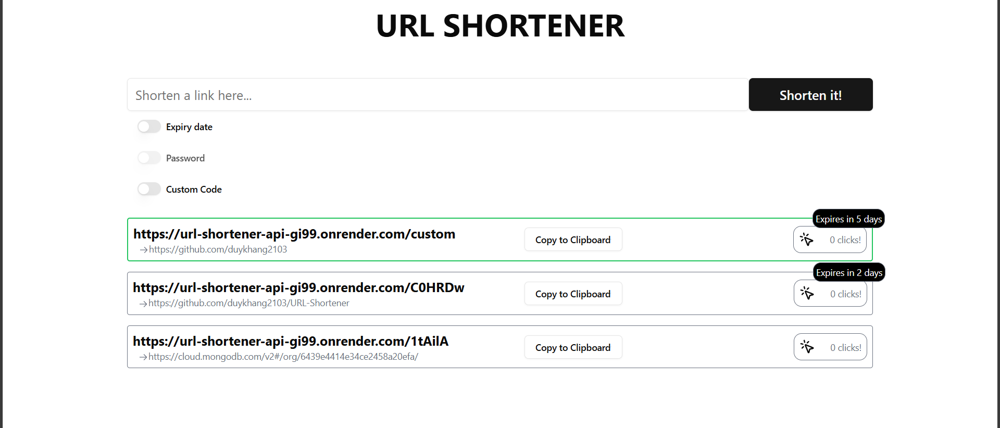
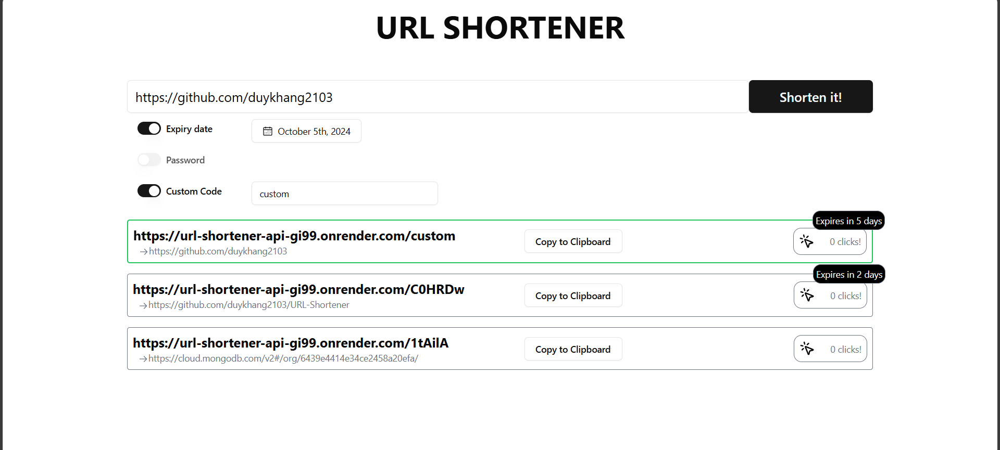

## URL Shortener

### Screenshot

1. Desktop

   
   

2. Mobile

   

### Core Requirements

1. Frontend:

- [x] Implement a form to submit long URLs
- [x] Display the generated short URL after submission
- [x] Include a "Copy to Clipboard" button for the short URL
- [x] Implement basic styling for a clean, responsive design

2. Backend:

- [x] Create an API endpoint to receive long URLs and return shortened versions
- [x] Implement a redirect service to handle requests for shortened URLs
- [x] Generate unique short codes for each submitted URL
- [x] Allow duplicate long URLs (each submission should create a new short URL)

3. Database:

- [x] Store mappings between short codes and original URLs
- [x] Save creation dates for each shortened URL

4. Deployment:

- [x] Deploy the application to a publicly accessible platform
- [x] Provide instructions for running the project locally

**Nice-to-have Features**

_If time permits, consider implementing one or more of these optional features_:

- [ ] Password Protection: Allow users to set a password for accessing certain shortened URLs
- [x] URL Expiry Date: Enable users to set an expiration date for shortened URLs
- [x] Custom Short Codes: Allow users to specify their own custom short codes

### Techstack

1. Language: TypeScript
2. Frontend: React, shadcn/ui
3. Backend: Express
4. Database: MongoDB

### Installation

1. Clone the repository:

   ```sh
   git clone https://github.com/duykhang2103/URL-Shortener.git
   ```

2. Open 2 terminals:

- The first terminal is used to run the server:

  1.  Install the project dependencies

  ```sh
  cd backend
  npm install
  ```

  2.  Create `.env` file and configure the environment variables

  ```sh
   MONGO_URI=
   SALT_ROUNDS=
  ```

  3.  Start the server

  ```sh
    npm run dev
  ```

- The second terminal is used to run the application:

  1.  Install the project dependencies

  ```sh
    cd frontend
    npm install
  ```

  2.  Create `.env` file and configure the environment variables

  ```sh
  VITE_BASE_URL=
  ```

  3.  Start the application

  ```sh
  npm run dev
  ```

### Usage

To use the URL Shortener API, make HTTP requests to the following endpoints:

- **POST** `{VITE_BASE_URL}/urls`: Shorten a long URL.
- **GET** `{VITE_BASE_URL}/urls`: Retrieve all short url created.
- **GET** `{VITE_BASE_URL}/{code}`: Redirect to the original URL.

### API documentation

For detailed information about the available API endpoints, please check the `{VITE_BASE_URL}/api-docs` , in which `VITE_BASE_URL` is your API's base URL as configured in your environment file.

### Deployment

This application has been deployed, aimed to give users better experience.

- Application: https://url-shortener-fe-jzwb.onrender.com/
- API: https://url-shortener-api-gi99.onrender.com/

### Future improvements

- Personalization: allow user to signup and store their own shortened urls.
- Secured shortened url: user can set password for their urls.
- Caching: retrieve faster urls generated lately.
- Advanced analytics: generate graphs analyzing generated and redirected shortened urls.
